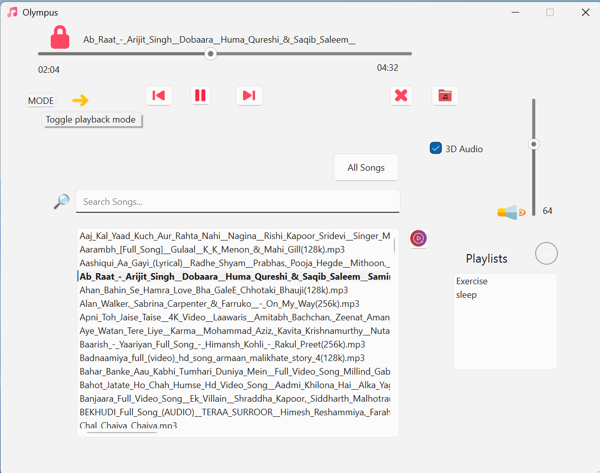

# 🎵 Qt Music Player

A modern music player application built using **Qt (C++)**, **SDL2**, and **SDL_mixer**. This player supports common audio formats and provides a smooth, responsive UI for browsing and playing music.

---

## 🚀 Features

- 🎧 Play, Pause, Stop, Next, Previous track controls
- 📂 Load and play local audio files (MP3, WAV, etc.)
- 🔊 Volume control and mute
- ⏱ Track duration display and progress bar
- 🎨 Responsive Qt-based GUI
- 🧰 Built with SDL2 and SDL_mixer for efficient audio handling

---

## 📸 Screenshot of the app



---

## 🛠 Dependencies

Make sure you have the following installed:

- [Qt 5/6](https://www.qt.io/download)
- [SDL2](https://www.libsdl.org/download-2.0.php)
- [SDL_mixer](https://www.libsdl.org/projects/SDL_mixer/)

---

## ⚙️ Build Instructions

### Linux / macOS

```bash
# Clone the repo
git clone https://github.com/AMAYKJHA/OLYMPUS-MusicPlayer.git
cd OLYMPUS-MusicPlayer

